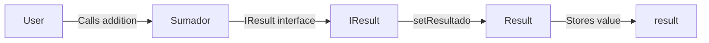

# <h1 align="center"> Smart Contract Connection with Interfaces </h1>

This repository contains a simple Solidity project created to understand how two Smart Contracts can interact with each other using an interface.

The project is composed of three files:

- [`Result.sol`](./Result.sol): stores the result of an operation.
- [`IResult.sol`](./Interfaces/IResult.sol): defines the external function exposed by `Result`.
- [`Sum.sol`](./Sum.sol): performs an addition and sends the result to the `Result` contract through the imported interface.

The main goal is to practice the following Solidity fundamentals:

- Communication between Smart Contracts.
- Solidity interfaces.
- Importing interfaces from external files.
- Calling functions from another deployed contract.
- Passing contract addresses through a constructor.
- Contract deployment order.
- `external` functions.
- `msg.sender`.
- Basic access control.
- State variables.
- Contract state updates.


### System flow



`Result` must be deployed before `Sumador`, since its contract address is required by the `Sumador` constructor.

Once deployed, `Sumador` uses [`IResult`](./Interfaces/IResult.sol) to interact with the [`Result`](./Result.sol) contract without requiring its complete implementation.


## Contract interaction

When `addition` is called, `Sumador` calculates the sum of the two provided numbers and sends the result to the external `Result` contract:

```text
User → Sumador → IResult → Result → result
```

The project also introduces basic access control through the `admin` address.

The `setFee` function checks `msg.sender` and only allows the configured administrator to update the `fee` state variable.